# 따로, 또 함께 달리는 런닝 어플리케이션 WADADA 

  

 

## 📌 프로젝트 소개
> SSAFY 10기 자율 프로젝트 - 런닝 어플리케이션 WADADA
>
> 개발 기간 : 2024.04.08 ~ 2024.05.20

#### 💡 WADADA 기획 배경
- 세계보건기구(WHO)의 권고에도 불구하고, 한국의 운동 실천율은 평균 47.9%에 불과합니다.
- 이러한 상황을 개선하고자, 누구나 즐겁게 운동할 수 있는 환경을 제공하는 것을 목표로 다인원 참여형 런닝 어플리케이션 'WADADA'를 기획하게 되었습니다.

#### 🏃 다양한 모드 제공
WADADA는 혼자서, 또는 여러 사람과 함께 달리기를 즐길 수 있는 다양한 모드를 제공합니다.
- 싱글모드
    - 거리모드 & 시간모드 : 사용자는 목표 거리나 목표 시간을 설정해두고 자유롭게 달릴 수 있습니다.
- 멀티모드
    - 거리모드 & 시간모드 : 사용자는 설정된 목표 거리나 시간 동안 다른 사용자와 경쟁하며, 목표를 가장 빨리 달성한 사람이 승리합니다.
    - 깃발모드 : 사용자 위치 정보를 기반으로 설정된 중간 지점까지 가장 빨리 도착하는 사람이 승리합니다.
- 마라톤
    - 참여 버튼을 통해 지정된 시간에 마라톤에 참여할 수 있습니다. 비대면으로도 여러 사람과 함께 마라톤을 즐길 수 있습니다.

#### 💬 실시간 측정 및 정보 제공
WADADA는 실시간 측정 및 정보 제공과 경쟁 요소를 통해 사용자들에게 더욱 즐겁고 동기부여가 되는 운동 경험을 제공합니다.
- 모든 모드에서 실시간으로 나의 경로, 소요 시간, 이동거리, 페이스, 속도, 심박수를 확인 가능하며 이를 통해 운동 상태를 즉시 파악할 수 있습니다.
- 멀티, 마라톤 모드에서는 실시간 순위를 제공하여 사용자에게 동기부여를 줍니다.

 

##  apk 파일
[apk 파일 다운로드](https://drive.google.com/file/d/1TwXMYtonIdHhuwh84yWLwK-n_SxClqPp/view?usp=sharing)

 

## 🧑 팀 구성
| [**김태수**](https://github.com/benyy0101) | [**박수민**](https://github.com/sueminPark) | [**유현종**](https://github.com/Drawjustin) | [**이윤정**](https://github.com/jjeong41) | [**현민수**](https://github.com/ms-7365) |
| :------: |  :------: | :------: | :------: | :------: |
| | |  |  |  |
| Leader, FE | FE | BE, Infra | FE | BE |
| GetX 컨트롤러 구축 마라톤 웹소켓 구현  마이페이지 구현  | 소셜 로그인 멀티 모드 레이아웃 구현 웨어러블 | MessageQueue과 WebSocket을 활용한 비동기 멀티쓰레드 구현 회원 인증/인가 CI/CD | 싱글 모드 전체 구현 멀티 모드 진행 구현  | 엘라스틱 서치 웹소켓 게임 API AOS |

 

## 🛠️ 기술 스택

**Front**
 

**Back**
 

**Database**
 

**Environment**
 

**Cooperation**
 

 

## 🌐 Setting
[포팅 메뉴얼 바로가기](./exec/readme.md)

 

## 🎨 아키텍처
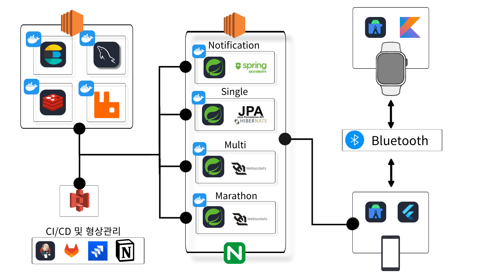

 

## 💡 주요 기능
|    프로필 생성    |
| :--------------: |
| 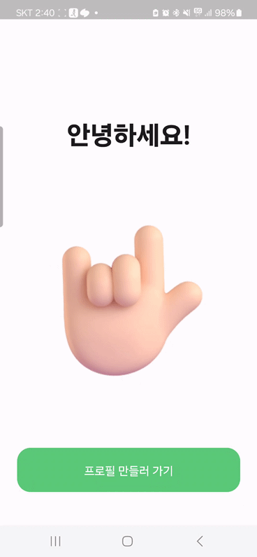 |
| - 카카오 소셜 로그인 지원 - 닉네임, 성별, 생일을 입력하여 프로필 생성 가능 |

 

| 싱글 모드 (거리모드, 시간모드) |
| :--------------: |
| 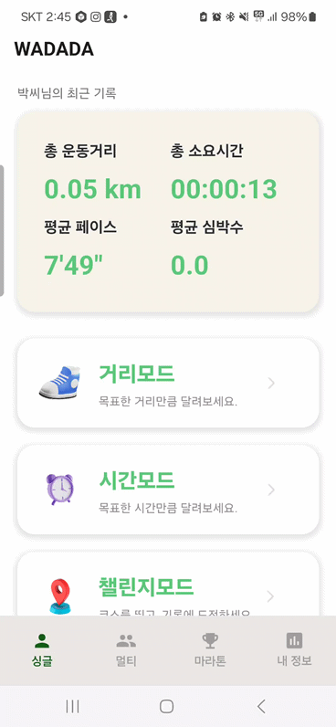 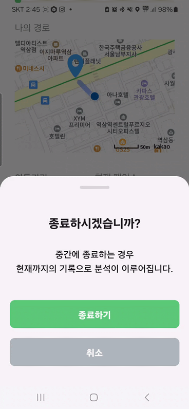 |
| - 목표 거리나 목표 시간을 설정해두고 자유롭게 달릴 수 있음 - 달리는 동안 지도를 통한 나의 경로, 소요 시간, 이동 거리, 속도, 페이스를 실시간으로 확인 가능 |

 

| 멀티 달리기 (거리모드, 시간모드, 만남모드) |
| :--------------: |
| 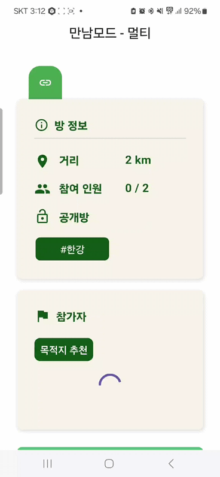 |
| - 거리모드, 시간모드 : 설정된 목표 거리나 시간 동안 다른 사용자와 경쟁하며, 목표를 가장 빨리 달성한 사람이 승리함. 싱글모드와 마찬가지로 달리는 동안 나의 경로, 소요 시간, 이동 거리, 속도, 페이스를 실시간으로 확인 가능하며 실시간 순위도 확인 가능 - 만남 모드 : 사용자 위치 정보를 기반으로 중간 지점을 설정해줌. 설정된 중간 지점까지 가장 빨리 도착하는 사람이 승리하는 모드. 나의 경로, 소요 시간, 이동 거리, 속도, 페이스, 실시간 순위 확인 가능 |

 

| 마라톤 |
| :--------------: |
| 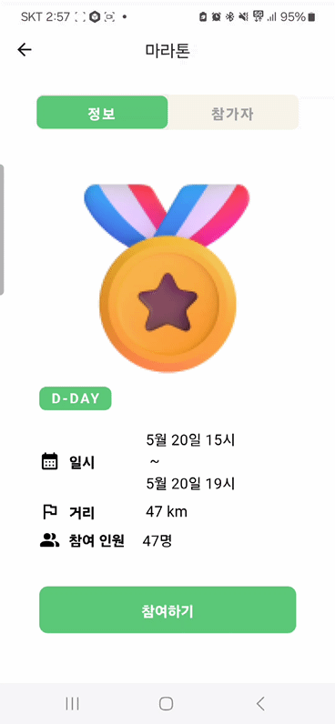 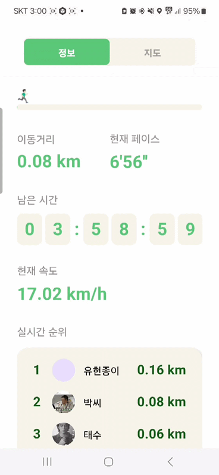 |
| - 참여 버튼을 통해 지정된 시간에 마라톤 참여 가능 - 실시간으로 나의 경로, 소요 시간, 이동 거리, 속도, 페이스, 실시간 순위 확인 가능 |

 

| 갤럭시 워치 연동 |
| :--------------: |
|  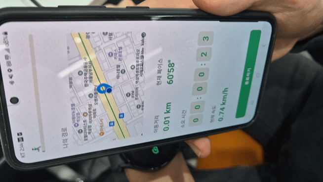 |
| 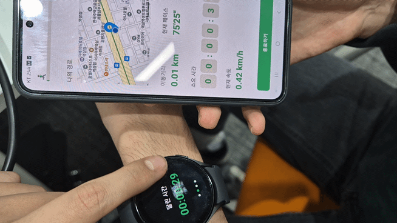 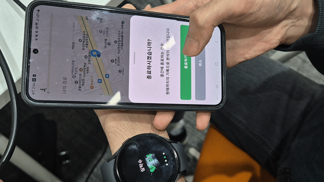 |
| - 블루투스를 통해 갤럭시 워치 연결 가능 - 워치를 통해 실시간 심박수 측정 및 전송 - 워치 내에서 소요 시간, 페이스, 심박수 실시간으로 확인 가능 |

 

| 마이페이지 |
| :--------------: |
| 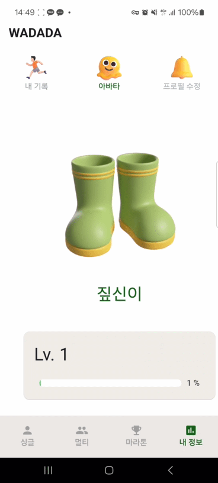 |
| - 나의 기록, 아바타, 프로필 수정 기능 제공 - 나의 기록 탭 : 달린 날짜, 경로, 이동 거리, 심박수, 페이스, 속도를 확인 가능 - 아바타 탭 : 나의 레벨과 레벨에 따른 아바타 확인 가능 - 프로필 수정 탭 : 프로필 수정 및 로그아웃, 탈퇴 가능 |

 
